# Android Auto Navigation Graph

This document describes the screen flow for Gaston on Android Auto.

```mermaid
graph TD
    Root[CarAppSession] --> Dashboard[AutoDashboardScreen]

    subgraph Dashboard Items
        Dashboard --> Fuel[AutoFuelDashboardScreen]
        Dashboard --> EV[AutoEvDashboardScreen]
        Dashboard --> MyVehicle[AutoMyVehicleDashboardScreen]
        Dashboard --> Other[Map Screen]
        Dashboard --> Routes[AutoRoutePlanningScreen]
        Dashboard --> Network[AutoNetworkLocationInfoScreen]
        Dashboard --> Emergency[AutoEmergencyScreen]
        Dashboard --> More[More Options Sub-menu]
    end

    subgraph Fuel Selection
        Fuel --> FuelMap[Map Screen]
    end

    subgraph EV Selection
        EV --> EVMap[Map Screen]
    end

    subgraph My Vehicle
        MyVehicle --> MVFuel[AutoFuelDashboardScreen]
        MyVehicle --> MVEV[AutoEvDashboardScreen]
        MyVehicle --> MVMap[Map Screen]
        MyVehicle --> MVSettings[AutoVehicleSettingsScreen]
    end

    subgraph Route Planning
        Routes --> RoutePreview[Map Screen]
    end

    subgraph Map Screen Variants
        MapScreen[Map Screen]
        MapScreen --> NativeMap[NativeMapPoiScreen]
        MapScreen --> CustomMap[CustomMapPoiScreen]
        MapScreen --> MapLibre[MapLibrePoiScreen]
    end

    subgraph Map Actions
        NativeMap --> MapMore[AutoMapMoreOptionsScreen]
        CustomMap --> MapSettings[AutoMapSettingsScreen]
        MapLibre --> MapSettings
        NativeMap --> PoiDetail[PoiDetailScreen]
        CustomMap --> PoiDetail
        MapLibre --> PoiDetail
    end

    subgraph More Menu
        More --> FuelOutlook[AutoFuelForecastScreen]
        More --> MapSettingsMenu[AutoMapSettingsScreen]
        More --> About[AutoAboutScreen]
    end

    subgraph Settings
        MapSettingsMenu --> VehicleSettings[AutoVehicleSettingsScreen]
        VehicleSettings --> VehicleType[AutoVehicleTypeSelectionScreen]
        VehicleSettings --> TankCap[AutoGasTankCapacitySelectionScreen]
        VehicleSettings --> GasCons[AutoGasConsumptionSelectionScreen]
        VehicleSettings --> BatCap[AutoBatteryCapacitySelectionScreen]
        VehicleSettings --> Range[AutoEvRangeSelectionScreen]
        VehicleSettings --> ElecCons[AutoEvConsumptionSelectionScreen]
    end
```

## Key Flows

### 1. Fuel Station Search
1. **Dashboard** -> Tap **Fuel**
2. **AutoFuelDashboardScreen** -> Select fuel type (e.g., Gazole, SP95)
3. **Map Screen** -> View stations and select a POI
4. **PoiDetailScreen** -> View details and start navigation

### 2. EV Charging Search
1. **Dashboard** -> Tap **EV**
2. **AutoEvDashboardScreen** -> Select power level (e.g., 50kW+, 150kW+)
3. **Map Screen** -> View charging stations and select a POI
4. **PoiDetailScreen** -> View details and start navigation

### 3. My Vehicle (Hybrid)
1. **Dashboard** -> Tap **My Vehicle**
2. **AutoMyVehicleDashboardScreen** -> Tap **Fuel** or **Electric** (depending on what you need)
3. Follow the respective search flow above.

### 4. Route Planning
1. **Dashboard** -> Tap **Routes**
2. **AutoRoutePlanningScreen** -> Enter Destination (and optionally Origin)
3. **Results List** -> View stations along the route
4. **Map Screen** (via Action Strip) -> Preview the route and stations
