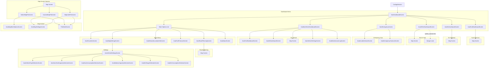

# Android Auto Navigation Graph

This document describes the screen flow for Gaston on Android Auto.

Root hub is a **6-tile GridTemplate** (Fuel, EV, Places, Emergency, My vehicle, More) so strict hosts with `CONTENT_LIMIT_TYPE_GRID` ≥ 6 show every entry.

```mermaid
graph TD
    Root[CarAppSession] --> Dashboard[AutoDashboardScreen]

    subgraph Dashboard Items
        Dashboard --> Fuel[AutoFuelDashboardScreen]
        Dashboard --> EV[AutoEvDashboardScreen]
        Dashboard --> Places[AutoOtherDashboardScreen]
        Dashboard --> Emergency[AutoEmergencyScreen]
        Dashboard --> MyVehicle[AutoMyVehicleDashboardScreen]
        Dashboard --> More[More Options List]
    end

    subgraph Fuel Selection
        Fuel --> FuelMap[Map Screen]
    end

    subgraph EV Selection
        EV --> EVMap[Map Screen]
    end

    subgraph Places Hub
        Places --> AmenityMap[Map Screen]
        Places -.->|speed_camera first| Radars[Danger zone]
    end

    subgraph Emergency Hub
        Emergency --> Accident[AutoAccidentAssistScreen]
        Emergency --> Contacts[AutoEmergencyContactsScreen]
    end

    subgraph My Vehicle
        MyVehicle --> MVFuel[AutoFuelDashboardScreen]
        MyVehicle --> MVEV[AutoEvDashboardScreen]
        MyVehicle --> MVMap[Map Screen]
        MyVehicle --> MVSettings[AutoVehicleSettingsScreen]
        MyVehicle --> MVLog[AutoMaintenanceLogScreen]
    end

    subgraph More Menu
        More --> Favorites[AutoFavoritesScreen]
        More --> Routes[AutoRoutePlanningScreen]
        More --> Network[AutoNetworkLocationInfoScreen]
        More --> FuelOutlook[AutoFuelForecastScreen]
        More --> MapSettingsMenu[AutoMapSettingsScreen]
        More --> About[AutoAboutScreen]
    end

    subgraph Route Planning
        Routes --> RoutePreview[Map Screen]
    end

    subgraph Map Screen Variants
        MapScreen[Map Screen]
        MapScreen --> NativeMap[NativeMapPoiScreen]
        MapScreen --> CustomMap[CustomMapPoiScreen]
        MapScreen --> MapLibre[MapLibrePoiScreen]
    end

    subgraph Map Actions
        NativeMap --> MapMore[AutoMapMoreOptionsScreen]
        CustomMap --> MapSettings[AutoMapSettingsScreen]
        MapLibre --> MapSettings
        NativeMap --> PoiDetail[PoiDetailScreen]
        CustomMap --> PoiDetail
        MapLibre --> PoiDetail
    end

    subgraph Settings
        MapSettingsMenu --> VehicleSettings[AutoVehicleSettingsScreen]
        VehicleSettings --> VehicleType[AutoVehicleTypeSelectionScreen]
        VehicleSettings --> TankCap[AutoGasTankCapacitySelectionScreen]
        VehicleSettings --> GasCons[AutoGasConsumptionSelectionScreen]
        VehicleSettings --> BatCap[AutoBatteryCapacitySelectionScreen]
        VehicleSettings --> Range[AutoEvRangeSelectionScreen]
        VehicleSettings --> ElecCons[AutoEvConsumptionSelectionScreen]
    end
```

## Key Flows

### 1. Fuel Station Search
1. **Dashboard** -> Tap **Fuel**
2. **AutoFuelDashboardScreen** -> Select fuel type (e.g., Gazole, SP95)
3. **Map Screen** -> View stations and select a POI
4. **PoiDetailScreen** -> View details and start navigation

### 2. EV Charging Search
1. **Dashboard** -> Tap **EV**
2. **AutoEvDashboardScreen** -> Select power level (e.g., 50kW+, 150kW+)
3. **Map Screen** -> View charging stations and select a POI
4. **PoiDetailScreen** -> View details and start navigation

### 3. Places (amenities)
1. **Dashboard** -> Tap **Places** (FR: Lieux)
2. **AutoOtherDashboardScreen** -> Pick amenity (danger zone / radars listed first)
3. **Map Screen** -> View POIs

### 4. Emergency
1. **Dashboard** -> Tap **Emergency**
2. Dial universal number, view GPS, or open local contacts
3. **I had an accident** -> `AutoAccidentAssistScreen` (MessageTemplate: location + dial). Full checklist / paper constat remain on the phone.

### 5. My Vehicle
1. **Dashboard** -> Tap **My vehicle**
2. Search (fuel/EV/map), vehicle settings, or read-only **service log** (`AutoMaintenanceLogScreen` — last service + due reminders, terminal)

### 6. More
1. **Dashboard** -> Tap **More**
2. Favorites, Routes, Network, Fuel outlook, Map settings, About
