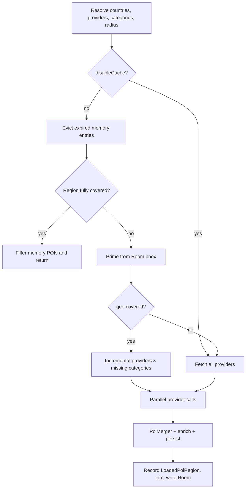

# POI cache, query optimization, and merge strategy

Gaston loads fuel stations, EV chargers, and OSM amenities from many country APIs. This document describes how those results are **cached**, how **network queries are minimized**, and how **duplicate places are merged**.

Primary code:

| Piece | Location |
| --- | --- |
| Fetch coordinator | `androidApp/.../poi/SelectorPoiProvider.kt` |
| Coverage / TTL helpers | `androidApp/.../poi/PoiFetchCache.kt` |
| Dedup / field merge | `shared/.../poi/PoiMerger.kt` |
| Display filters (after fetch) | `androidApp/.../MapFilterSettings.kt` (`StationMapFilters`) |
| Disk cache | `androidApp/.../persistence/PoiCacheDao.kt` |

---

## Goals

1. **Show something immediately** — memory, then Room, then network.
2. **Do not re-query a region** that is already covered for the requested providers and categories.
3. **Fetch only what is missing** when the user toggles energy mode or amenities (incremental queries).
4. **Treat one physical place as one marker** even when several APIs return it.

Map filters (fuel type, power, brand, highway-only) run **after** cache/network. They never shrink the fetch itself, so toggling a chip can reuse cached POIs.

---

## Two-level cache

```
Map / Auto / dashboard
        │
        ▼
SelectorPoiProvider
        │
        ├── 1. Memory: cachedPois + loadedRegions
        ├── 2. Room: poi_cache (JSON blobs, bbox query)
        └── 3. Network: only missing providers × categories
```

### Memory (`SelectorPoiProvider`)

- **`cachedPois`**: map of station id → `Poi`.
- **`poiSeenAtMs`**: last time that id was written (TTL clock).
- **`loadedRegions`**: geographic coverage metadata (`LoadedPoiRegion`), not the POI list itself.

Limits (hardcoded in `search` / `searchFlow`):

- about **1200** POIs — farthest from the current map center are dropped first (`trimPoiCache`)
- **12** loaded regions — farthest region from the current center is dropped first

### Disk (Room `poi_cache`)

Each row stores `id`, lat/lng, name, address, full `poiJson`, and `updatedAtMs`. Lookups use a bounding box around the request plus `updatedAtMs >= now - disk retention`.

`searchFlow` also deletes rows older than disk retention about **once per hour**. Price-history samples are kept **30 days** (`StationPriceHistoryRepository`).

Setting **`disableCache`** skips memory/disk coverage and always hits the network.

---

## TTL and freshness

Constants live in `PoiFetchCache.kt`. Disk retention and per-POI expiry both use **7 days**.

| What | Rule |
| --- | --- |
| Amenity POIs (parking, toilets, …) | Keep 7 days. Region is “fresh” if loaded within 7 days. |
| Energy POIs (Gas, IRVE, battery swap) | Keep the **static** station in cache for 7 days so the map is not empty. **Refetch** when the category was not loaded **today** (`isSameDay`) so prices/availability update daily. |
| Disk rows | Same 7-day window (`POI_CACHE_DISK_RETENTION_MS`). |

`isPoiCacheEntryExpired` is the 7-day wall for individual rows. `categoryCacheStillFresh` is the **region** check used to decide whether to call APIs again.

---

## What gets queried

### 1. Providers

`AppSettings.effectiveProviders(countryCodes)`:

- **Auto**: country from GPS / map viewport (`ParkingRegion`), then the country’s default sources.
- **Manual**: `selectedPoiProviders`.
- Then **energy filter**: fuel mode drops electric-only APIs; electric/swap drops fuel-only APIs; hybrid keeps both. Overpass is kept when it is in the set.
- **Routex fuel card** (vehicle filter): always adds Routex + Overpass.

Changing the **provider set** (including energy-driven drops) rebuilds `buildPoiFetchKey(...)`. If the key changed, **`loadedRegions` is cleared** so stale coverage is not treated as complete (`invalidateRegionCoverageOnProviderSetChange`). In-memory POIs are kept until eviction; the next search may still skip network if disk/memory already has the new categories.

### 2. Categories

`resolveCategoriesToFetch(settings, request.categories)`:

- energy / amenities from `effectiveAllowedCategories()` (selector, “Other” mode, vehicle type)
- plus **`cacheWarmAmenityTypes`**: amenities the user already loaded in “Other” mode, so parking (etc.) stays in the cache when switching back to fuel/EV
- plus any extra categories on the `PoiSearchRequest`

Radius is derived from the map viewport, clamped to **1–50 km** (default 10 km without a viewport).

---

## Coverage and incremental fetch

A request is covered only if **both** geography and payload match.

### Geographic cover (`findCoveringRegion`)

A stored region covers the request when:

- `region.maxRadiusKmLoaded >= requiredRadiusKm`
- haversine(request center, region center) ≤ `maxRadiusKmLoaded - requiredRadiusKm` (+ 0.5 km slack)

So a 20 km load around Paris covers a later 10 km pan that still sits inside that circle. Panning outside starts a new region (or expands the covering one via `mergeLoadedRegion`).

### Payload cover (`computePoiCoverage`)

Given a covering region:

- **missing providers** = requested providers not in `loadedProviders`
- **missing categories** = requested categories that fail `categoryCacheStillFresh`

`fullyCovered` ⇒ return filtered memory cache, **no network**.

If geography is covered but categories/providers are incomplete, **`providersForIncrementalFetch`** picks the smallest API set:

| Missing category | Providers called |
| --- | --- |
| Gas | fuel providers (`providesFuel`) |
| IRVE / battery swap | electric / swap providers |
| Other amenities | Overpass (if enabled) |
| Overpass also listed as a fuel/EV source | Overpass is included when Gas/IRVE is missing |

Each remaining provider is asked only for `missingCategories ∩ supportedCategories()` (or the full requested set if that provider itself was missing).

### After a fetch (`mergeLoadedRegion`)

The covering region (or a new one) unions:

- providers and categories
- `maxRadiusKmLoaded = max(old, new)`
- per-category timestamps (`categoryLoadedAtMs`) so parking loaded yesterday can stay fresh while Gas is refetched today

---

## Search pipeline

Used by phone map (`searchFlow`, streaming) and one-shot callers (`searchResult`).



`searchFlow` extra behaviour:

- emit cached/filtered POIs **before** network when geo is already covered
- fetch providers **in parallel** and merge each batch into `cachedPois` as it arrives
- persist Room on the provider scope so the collector can close without losing writes

---

## Merge strategy (`PoiMerger`)

Same physical site often appears in DataGouv, Overpass, OpenChargeMap, etc. Merge is **centralized** so map cache, Auto screens, and dashboard all share the rules.

### When two POIs are the same

Checked in order (`isSamePoi`):

1. Same `id`.
2. Distance **≤ 50 m** → always merge.
3. Distance **≤ 300 m** and **same resolved brand** (`BrandRegistry`).
4. Distance **≤ 300 m**, both Gas, **exactly one has fuel prices**, and **at least one** has a known brand or non-generic name (OSM brand ↔ DataGouv prices).
5. Distance **≤ 300 m** and **name similarity ≥ 0.8** (token Jaccard on normalized `siteName` + `name`, French diacritics folded).

A cheap lat/lng box rejects pairs before haversine.

### How fields are combined (`mergeTwo`)

- **Coordinates** prefer the source with a known brand / specific name (often OSM); otherwise keep existing.
- **Primary category** prefers Gas, then IRVE; other types go to `extraCategories` (a supermarket+station can show as a station with extra amenity).
- **Fuel prices**: per fuel name, keep the **newer** `updatedAt`; `outOfStock` is OR’d. All prices older than **4 weeks** ⇒ treat station as closed.
- **IRVE**: union connector types; prefer incoming live availability/tariff fields when non-null.
- **Amenities**: `true` wins over `false` over `null`.
- **Name / brand**: drop generic labels (`station`, `independant`, …); prefer names/brands that resolve in `BrandRegistry` and have an icon.
- **Sources**: concatenate unique source labels; keep latest `sourceUpdates` per source.

APIs:

- `mergePois` — full pairwise pass on a batch (deterministic: sort by id).
- `mergeInto(existing, incoming)` — keep list/map identity; used when folding network or Room results into `cachedPois`.

### Supermarket brand enrich

Unbranded Gas stations can inherit a nearby supermarket brand within **300 m** (`enrichBrandsFromSupermarkets`). Overpass supermarket fetches for enrich go to a **separate in-memory cache** (not map `cachedPois` / Room) so they are not shown unless the user enables the Supermarket amenity.

---

## Display vs cache

`StationMapFilters.apply` runs on the cached list for the **current** settings (energy chips, power, connectors, highway, Routex-only, brands). Cached rows may include categories the UI currently hides; they stay in memory so toggling back is instant.

---

## Invalidation

| Event | Effect |
| --- | --- |
| Provider set key changes | Clear `loadedRegions` only |
| `clearCache()` | Memory + Room + each provider’s own cache |
| Hourly job | Delete Room rows older than 7 days |
| Memory over 1200 / 12 regions | Drop farthest POIs / regions |

---

## Tests

Coverage, TTL, incremental providers, and Routex/energy provider selection: `androidApp/src/test/.../PoiFetchCacheTest.kt`. Merger behaviour lives under `shared` tests for `PoiMerger` / brand merge.
