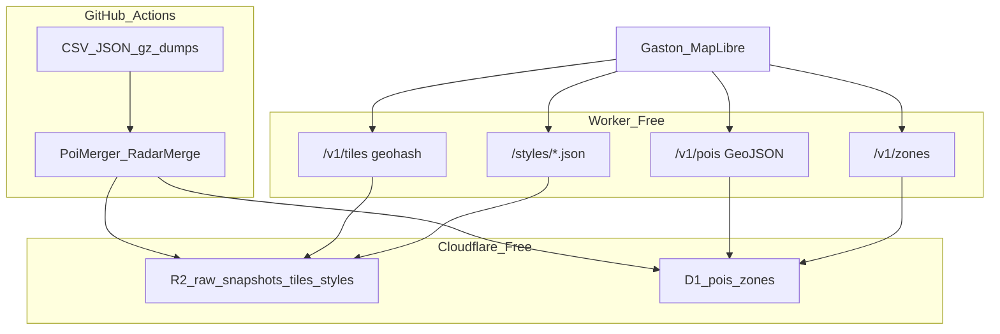

# Backend Cloudflare — coût mini + dumps/merge + carte

> Plan sauvegardé (2026-10-01, complété catalogue + perf ; bootstrap no-app/$0 2026-10-02).  
> Cursor : `~/.cursor/plans/cf_backend_geo_api_67d8cead.plan.md`  
> Statut : **non implémenté** — prêt à bootstrap backend seul.

## Overview

Backend Cloudflare ~$0 (Workers Free + D1 + R2 + GitHub Actions) pour :

1. Centraliser **dumps CSV / JSON / gz / gros fichiers** et **merges** multi-sources
2. Exposer une API GPS → **GeoJSON** (et tuiles POI légères)
3. Optionnellement servir **styles carte** / tuiles vectorielles / overlays GeoJSON plus légers que le client actuel

---

## Bootstrap : sans toucher l’app, sans payer

**Oui.** On démarre le backend **sans aucun changement** à `:androidApp` / `:shared`, et **sans Workers Paid**.

| Contrainte | Comment |
|------------|---------|
| **Emplacement** | Module monorepo **[`backend/`](../../backend/)** à la racine Gaston (Worker + wrangler + scripts GHA) — **pas** un sous-projet Gradle Android |
| **$0** | Compte Cloudflare Free + Workers Free + D1 Free + R2 free tier + GHA — **pas** d’upgrade Paid, **pas** de Cron CF |
| **App inchangée** | Aucune dépendance Gradle `backend` ↔ `androidApp` / `shared` ; l’app continue ses providers locaux |
| **Validation** | `curl` / tests dans `backend/` ; pas de feature flag mobile tant que l’API n’est pas stable |
| **Client plus tard** | Todo `android-client` explicitement **après** ; opt-in seulement quand prêt |

### Layout cible `backend/`

```
backend/
  package.json / wrangler.toml   # Worker Free, bindings D1 + R2
  src/                           # API fetch handler (GeoJSON, auth)
  migrations/                    # schéma D1
  scripts/ingest/                # parse CSV/merge (Node), appelé par GHA
  .github/workflows/             # ou workflow racine pointant backend/
  README.md                      # setup wrangler login, secrets, curl examples
```

Prérequis gratuits : compte Cloudflare, `npx wrangler login`. Pas de CB pour Free.

Limites Free jour 1 : **pas de parse CSV dans le Worker** (scripts GHA only) ; **≤ ~100k writes D1/jour**.

Ne pas ajouter `backend` aux `settings.gradle.kts` Android — c’est un projet **Node/Wrangler** côte à côte, pas un module KMP.

---

## Todos

- [ ] **Bootstrap `backend/`** : scaffold Worker Free + D1 + R2 (hors Gradle Android)
- [ ] Pipeline GHA générique (plugin par source File/dump)
- [ ] V1 : Gireve + QualiCharge + radars FR/LU → D1 + GeoJSON API
- [ ] V1.1 : Minetur, MIMIT, DOT-NL gz, NOBIL, Belgium NAP, EIPA…
- [ ] Merge serveur (`PoiMerger` / `RadarPoiMerger` / availability)
- [ ] Couche carte : GeoJSON overlays + tuiles geohash POI ; styles hébergés optionnels
- [ ] Garde-fous writes D1 100k/jour + doc coût
- [ ] **(Plus tard, opt-in)** Client Gaston mince + fallback local — *ne bloque pas le setup*

---

## Objectif

- Coût **minimal** (~$0 Free CF + GHA) — **phase bootstrap sans paiement**
- **Zéro diff mobile** jusqu’à validation API manuelle
- Toutes les APIs **dump / CSV / gros fichier / merge-heavy** candidates backend
- API sécurisée `lat/lon/radius` → GeoJSON (et tuiles légères)
- Thèmes / tuiles carte plus performants si pertinents
- Décision éclairée **backend vs no-backend** (perf + coût)

---

## Catalogue — sources dump / CSV / gros fichier / merge

Priorité backend = **High** si download national × N users, ou clé à cacher, ou merge multi-feeds.

### A. `PoiProviderFetchKind.File` (enum officiel)

| Source | Format | Volume / note | Clé | Priorité BE |
|--------|--------|---------------|-----|-------------|
| **Gireve** | CSV static + dynamic (transport.data.gouv) | ~34k+ PDC FR | Non | **High** |
| **QualiCharge** | CSV static + dynamic | National FR IRVE | Non | **High** |
| **Spain Minetur** | JSON REST national | ~**5 MB** all stations ES ; cache session | Non | **High** |
| **Italy MIMIT** | 2× CSV (`prezzo_alle_8` + `anagrafica`) | National IT | Non | **High** |
| **Croatia MZOE** | `data.json` | National HR | Non | Med |
| **Argentina Energía** | CSV open data | National AR | Non | Med |
| **France radars** | CSV data.gouv | Milliers radars fixes | Non | **High** (AAC) |
| **Luxembourg radars** | GeoJSON geoportail | ~39 cams | Non | Med (petit mais File) |

### B. Dumps / gros fichiers hors enum File (même douleur client)

| Source | Format | Volume / note | Clé | Priorité BE |
|--------|--------|---------------|-----|-------------|
| **DOT-NL / NDW** | OCPI **JSON.gz** national NL | Gros gunzip + parse sur device | Non | **High** |
| **NOBIL** NOR/SWE | Datadump JSON | Dump pays ; **ToS : ne pas exposer API brute aux users** | Oui | **High** (proxy + cache) |
| **Belgium NAP** (Road) | `locations.json` OCPI-like | Bulk BE | Non | **High** |
| **EIPA** (PL) | Export reader | Export national PL | Opt. | **High** |
| **ich-tanke-strom** (CH) | Static geo.admin + status JSON | Bulk CH | Non | Med–High |
| **Digitraffic AFIR** (FI) | Locations + statuses API | Peut être volumineux | Non | Med |
| **Fastned UK** | OCPI dump/list | ~100 stations UK | Oui | Low–Med |
| **Chargy** (LU) | KML | Petit LU | Oui | Low (clé) |
| **Eco-Movement** | OCPI | Geo API mais clé + ToS | Oui | **High** (proxy) |
| **DKV OCPI** | OCPI | Clé | Oui | Med (proxy) |
| **Open Charge Map** | API geo | Clé ; pas un dump unique | Oui | Med (proxy rate-limit) |
| **Routex / Wigeogis** | API (Europe) | ~18k stations ; appels répétés | Non | Med (cache serveur) |
| **DataGouv fuel** flux/quotidien | API explore (pages) | Pas 1 fichier mais pagination lourde | Non | Med |
| **Gas API** | API | FR | Non | Low |
| **goriva.si** | API paginée | ~551 SI ; full crawl possible | Non | Med |
| **NSW FuelCheck** | API | Clé+secret | Oui | Med (proxy) |
| **Tankerkönig** | API geo | Clé | Oui | Med (proxy) |
| **AFDC/NREL** | API nearest | Clé | Oui | Low–Med |
| **Overpass** | Query bbox | Pas dump national ; rate-limit public | Non | Med (cache tiles OSM amenity) |
| **Lufop** | API geo radars | Max 200/call ; clé | Oui | **High** (proxy + cache) |
| **CITA traffic** (LU) | GeoJSON multi-routes | Overlays trafic | Non | Med (cache) |
| **Belib’** | OpenData Paris | Complément QC | Non | Low (petit) |

### C. Merges côté client → à porter serveur

| Merge | Règles | Fichiers |
|-------|--------|----------|
| **PoiMerger** | id / refId / ≤50 m / brand ≤300 m / name Jaccard 0.8 / prices / IRVE | `shared/.../poi/PoiMerger.kt` |
| **RadarPoiMerger** | Primary (Lufop/FR/LU) vs OSM ≤40 m | `RadarPoiMerger.kt` |
| **DangerZoneRepository** | Lufop∪LU → else FR → else OSM + StaticNonRadar + OSM enrich | `DangerZoneRepository.kt` |
| **RadarOsmEnricher** | Direction ≤40 m | `RadarOsmEnricher.kt` |
| **MergedBorneAvailability** | QC + Belib (Paris) ; factory pays | `MergedBorneAvailabilityProvider` |
| **Supermarket enrich** | Brand ≤300 m (Overpass cache) | `SelectorPoiProvider` / `PoiMerger` |
| **WifiGatedBulkAvailability** | Évite dumps IRVE sur cellulaire | `WifiGatedBulkAvailabilityProvider` — **symptôme** que le dump client est trop lourd |

### D. Hors scope backend (rester client ou API geo native)

APIs déjà **nearby/bbox** légères : DrivstoffAppen, ANWB, DGEG, E-Control fuel, Fuelprices.dk (clé), Pick A Pump, Comparis, etc. — faible ROI sauf unifier auth.

---

## Carte — tuiles, thèmes, GeoJSON

### État actuel (no-backend)

| Couche | Aujourd’hui | Douleur |
|--------|-------------|---------|
| Styles MapLibre | OpenFreeMap CDN (`tiles.openfreemap.org/styles/{dark,bright,liberty,positron,fiord}`) via [`MapTheme`](../../androidApp/src/main/kotlin/fr/geoking/gaston/SettingsManager.kt) | Dépendance tierce ; pas de thème Gaston custom |
| MapTiler | Styles cloud + clé | Coût / quota utilisateur |
| Protomaps / PMTiles | Download régional BBBike (dizaines–centaines Mo) offline | Gros download user ; planet Protomaps ~120 GiB non viable |
| Mapsforge | Fichiers `.map` offline | Idem stockage device |
| POI sur carte | Markers depuis providers + merge client | N× dumps ; pas de GeoJSON tuilé |
| Trafic | CITA GeoJSON + TomTom | Fetch client |

### Ce qu’un backend cheap peut apporter

| Livrable | Mécanisme | Coût | Gain |
|----------|-----------|------|------|
| **GeoJSON POI** `GET /v1/pois?lat&lon&r` | D1 bbox → FeatureCollection | Free | Remplace dumps ; payload petit (dizaines–centaines features) |
| **Tuiles POI geohash** `GET /v1/tiles/{z}/{hash}.geojson` | GHA précalcule → **R2** ; Worker sert objet | Free | Cache CDN-like ; ultra léger ; bon pour pan/zoom |
| **MVT / PMTiles POI** (option) | Tippecanoe en GHA → R2 | Free + CI minutes | Encore plus léger que GeoJSON dense |
| **Styles Gaston** | JSON style MapLibre sur R2/Workers Assets pointant tuiles OpenFreeMap ou self-host | Free | Thème AA (contrasté, night driving) sans MapTiler |
| **Proxy tuiles** (option) | Worker cache OpenFreeMap/OSM | Risque ToS + CPU Free | Souvent **pas** worth ; garder CDN public pour basemap |
| **Overlays** trafic/radars | GeoJSON ou tuiles R2 | Free | Une URL stable pour MapLibre `addSource` |

**Reco carte V1 :** ne **pas** self-host basemap mondiale. Servir **POI/zones en GeoJSON + tuiles geohash R2** + éventuellement **1–2 styles JSON** Gaston (dark AA / day) qui référencent OpenFreeMap. Offline PMTiles reste download user ou miroir R2 des extraits BBBike (egress R2 free vers clients… R2 egress to Internet is free actually - good for hosting regional pmtiles!).

**R2 pour PMTiles régionaux :** possible miroir FR/LU/BE pour UX (une URL Gaston) — stockage R2 cheap ; pas de frais egress. Priorité **Low–Med** vs POI API.

---

## Architecture (rappel cheap)



Scheduler : **GHA only** (pas Cron CF Free 10 ms). Dynamic IRVE : diff 2–3×/jour (quota D1 writes).

---

## Comparatif perf / coût — backend vs no-backend

Hypothèses : utilisateur FR, IRVE+fuel+radars, rayon 15–25 km, 1 session/jour ; flotte N devices.

### Coût infra

| | No-backend (actuel) | Backend cheap (plan) | Backend Paid CF |
|--|---------------------|----------------------|-----------------|
| Cloudflare / serveur | **$0** | **~$0** (Free + GHA) | ~$5+/mois |
| Clés API (Lufop, NOBIL…) | Dans l’APK / local.properties | Secrets serveur | Idem |
| Coût user data cellulaire | **Élevé** (dumps 5–50+ MB possibles) | **Faible** (réponse API ~10–200 KB) | Faible |
| CI | — | Minutes GHA | + Cron CPU |

### Perf / UX

| Critère | No-backend | Avec backend |
|---------|------------|--------------|
| Time-to-first-POI (froid, IRVE FR) | Mauvais : download CSV/gz + parse | Bon : 1 GET bbox |
| Batterie / CPU device | Parse 34k+ rows, gunzip NL | Faible |
| Fraîcheur dispo IRVE | ~45 s possible | **Heures** sur Free (trade-off) ou Paid |
| Multi-providers merge | Chaque device | 1× serveur ; résultat stable |
| Offline | Room + dumps locaux | Cache API + PMTiles inchangé |
| Carte basemap | OpenFreeMap OK | Idem (+ styles Gaston optionnels) |
| Charge serveur | 0 | Reads D1 ; risque 100k writes/jour |
| ToS clés (NOBIL, Eco-Movement) | Zone grise si clé dans app | **Meilleur** (proxy) |
| WifiGated hacks | Nécessaire | Moins nécessaire |

### Quand no-backend gagne

- 1 user / debug sparse
- Uniquement APIs geo natives (Tankerkönig nearby, Drivstoff…)
- Besoin dispo IRVE **sub-minute** sans budget Paid
- Zéro envie d’ops (même Free)

### Quand backend gagne (net)

- File/dumps : Gireve, QualiCharge, Minetur 5 MB, MIMIT CSV, DOT-NL gz, NOBIL, Belgium NAP, EIPA, radars
- Plusieurs providers + `PoiMerger` sur le même viewport
- Android Auto / cellulaire : latence et data
- Cacher les clés + respecter ToS dump
- Servir GeoJSON/tuiles POI stables pour MapLibre

### Ordre de grandeur data (1 cold start IRVE FR)

| | No-backend | Backend |
|--|------------|---------|
| Download | ~plusieurs MB CSV×2 (static+dynamic) | ~50–150 KB GeoJSON filtré |
| Parse device | O(34k) | O(100) features |
| Réseau N users | N × dump | 1× dump (GHA) + N × petit GET |

**Verdict :** pour Gaston multi-sources Europe, le **backend cheap est gagnant en perf user et data** dès que File/dumps sont utilisés ; le **coût $0** tient si writes D1 disciplinés et basemap reste CDN public. No-backend reste OK comme **fallback** offline / feature-flag.

---

## Phases d’implémentation

### Phase 0 — fondations (`backend/` only)
Créer `backend/` (wrangler, D1 `pois`/`zones`/`ingest_meta`, R2, Bearer auth, GHA skeleton, README). Aucun commit Gradle / Android.

### Phase 1 — High priority dumps
Gireve, QualiCharge, France+LU radars, Minetur, MIMIT → API GeoJSON + merge radar/IRVE basique.

### Phase 2 — Availability dumps + clés
DOT-NL gz, Belgium NAP, NOBIL proxy, EIPA, Lufop lazy/cache ; tuiles geohash R2.

### Phase 3 — Carte
Styles JSON Gaston (day/night AA) sur R2 ; overlay GeoJSON radars/trafic ; option miroir PMTiles région.

### Phase 4 — Client
`GastonBackendPoiProvider` ; retirer WifiGated quand backend on ; fallback local.

---

## Hors scope V1

- Self-host tuiles OSM mondiales
- Cron Cloudflare Paid (sauf si unifier vendor)
- Dispo IRVE sub-minute sur Free
- Port de *toutes* les APIs geo légères

---

## Références code / docs

- File enum : [`Poi.kt`](../../shared/src/commonMain/kotlin/fr/geoking/gaston/poi/Poi.kt)
- Catalogue sources : [`docs/sources.md`](../sources.md)
- IRVE : [`docs/IRVE_DYNAMIQUE.md`](../IRVE_DYNAMIQUE.md), Gireve client
- DOT-NL : [`docs/DOTNL_AVAILABILITY.md`](../DOTNL_AVAILABILITY.md)
- NOBIL : [`docs/NOBIL_AVAILABILITY.md`](../NOBIL_AVAILABILITY.md)
- AAC : [`docs/AAC_DATA.md`](../AAC_DATA.md)
- Thèmes : `MapTheme` dans `SettingsManager.kt` ; PMTiles `PmtilesPresetServers`
